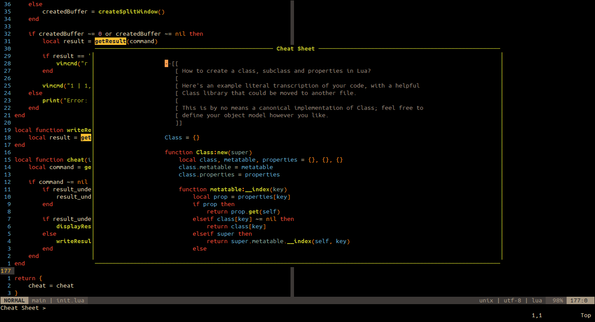

# vim-chtsh

A simple NeoVim plugin to browse [cheat.sh](https://cheat.sh).



## About vim-chtsh

This is a personal, lightweight plugin so there are not many features.

Checkout the official [cheat.sh-vim](https://github.com/dbeniamine/cheat.sh-vim)
plugin for more useful tools.

## Installation

Using [vim-plug](https://github.com/junegunn/vim-plug)

```viml
Plug 'b72u68/vim-chtsh'
```

Using [dein](https://github.com/Shougo/dein.vim)

```viml
call dein#add('b72u68/vim-chtsh')
```

## Usage

Default Settings for vim-chtsh:

```viml
" Show comments in result (default: 1)
" (0: remove comments in result, 1: show comments in result)
let g:chtsh_include_comments = 1

" Search result is written under the cursor in current bufer (default: 0)
" (0: show result in buffer, 1: write result in the working buffer)
let g:chtsh_result_under_cursor = 0

" Config result window size (value: from 0 to 1)
" If you want result to be in the split, change the setting to
" g:chtsh_layout = { "split": "vertical" } (display result in vertical split)
" or g:chtsh_layout = { "split": "horizontal" } (display result in horizontal split)
let g:chtsh_layout = { "width": 0.7, "height": 0.7 }

" Search for query and display result in new buffer
nnoremap <leader>ch :call CheatSheet()<CR>

" Search for query and paste the result in current buffer
nnoremap <leader>cp :call CheatPaste()<CR>
```

Calling CheatSheet() function will ask user for search query ("Cheat Sheet > ").
After entering the query, the result will be placed in a floating buffer or
paste to the current working buffer.
